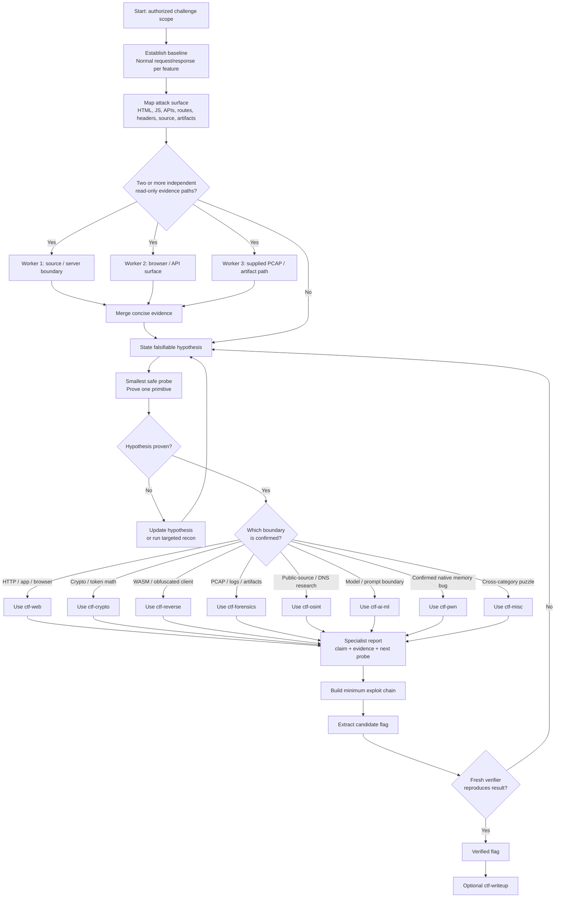

# Web CTF

`web-ctf` is a portable Agent Skill for authorized web CTF challenges. It owns an evidence-led investigation loop: establish the baseline, map the attack surface, form and test a falsifiable hypothesis, construct the minimum exploit chain, and independently verify the flag.

It is an orchestrator, not a replacement for specialist techniques. It chooses an installed companion CTF skill only when evidence establishes that skill's boundary, then brings the result back to the primary loop for verification.

## Contents

```text
web-ctf/
├── SKILL.md
├── README.md
├── agents/
│   └── openai.yaml
└── references/
    └── bounded-graph.md
```

## Scope

Use only with challenge URLs, source bundles, containers, APIs, browser clients, accounts, and artifacts explicitly authorized for a CTF, lab, or other permitted assessment. Do not test third-party systems, persist access, exfiltrate unrelated data, or disrupt services.

## Install with the Skills CLI

After publishing this repository, replace `<OWNER>` with its GitHub owner:

```bash
npx --yes skills add <OWNER>/web-ctf --global \
  --agent codex --agent claude-code --yes
```

Preview before installation:

```bash
npx --yes skills add <OWNER>/web-ctf --list
```

To install into the current project instead of globally, omit `--global`.

## Manual install

Clone the repository:

```bash
git clone https://github.com/<OWNER>/web-ctf.git
cd web-ctf
```

### Codex

```bash
mkdir -p "${CODEX_HOME:-$HOME/.codex}/skills/web-ctf"
cp -R SKILL.md agents references "${CODEX_HOME:-$HOME/.codex}/skills/web-ctf/"
```

### Claude Code

```bash
mkdir -p "$HOME/.claude/skills/web-ctf"
cp -R SKILL.md agents references "$HOME/.claude/skills/web-ctf/"
```

### Project-local universal Agent Skills

```bash
mkdir -p .agents/skills/web-ctf
cp -R /path/to/web-ctf/. .agents/skills/web-ctf/
```

Restart the target agent after installation.

## Install companion CTF skills

Install [ljagiello/ctf-skills](https://github.com/ljagiello/ctf-skills) so the orchestrator can route confirmed subproblems to the relevant specialist:

```bash
npx --yes skills add ljagiello/ctf-skills --global \
  --agent codex --agent claude-code --yes
```

`web-ctf` uses the following only when evidence warrants them:

| Evidence | Companion skill |
| --- | --- |
| HTTP attack surface; injection; auth; browser; server-side parser/execution; uploads; Web3 | `ctf-web` |
| Custom crypto, MAC/token math, PRNG, encoding or key recovery | `ctf-crypto` |
| WASM, obfuscated JavaScript, binary, custom VM, client reconstruction | `ctf-reverse` |
| Confirmed native memory-corruption primitive after a web foothold | `ctf-pwn` |
| Supplied PCAP, logs, disk image, memory dump, or offline artifacts | `ctf-forensics` |
| Challenge-scoped public-source, DNS, hostname, image, or social research | `ctf-osint` |
| Model, prompt, or ML boundary intentionally present in the challenge | `ctf-ai-ml` |
| Verified flag and requested competition submission | `ctf-writeup` |

## Use

Provide the challenge scope and any URL, artifacts, source, or test account, then ask:

```text
Use $web-ctf to investigate this authorized web CTF challenge. Keep an evidence log, use bounded graph mode only for independent paths, and return a verified flag or the next evidence-backed hypothesis.
```

## Workflow

```text
Authorized scope → baseline → surface map → hypothesis → smallest safe probe
    → evidence-backed specialist route (only when needed) → minimum chain
    → candidate flag → independent verification → optional writeup
```



Choose one evidence-matched specialist route, not every route. Each route returns a compact report before the owner continues the exploit chain.

Use graph mode only at the decision shown above: maximum three read-only workers, concurrency three, two waves, and one retry per worker. Do not let workers mutate shared target state, exploits, evidence notes, or writeups. Read [bounded graph mode](references/bounded-graph.md) for worker contracts, merging, and narrow repair routing.

## What a completed solve contains

- Challenge identity and authorized scope.
- Initial clue and concise evidence trail.
- Exact trust boundary and proven primitive.
- Reproducible requests, commands, or artifact paths.
- Candidate flag and an independent verification anchor.
- Selected companion skills, with the evidence that selected each one.
- One reusable lesson or pattern.
